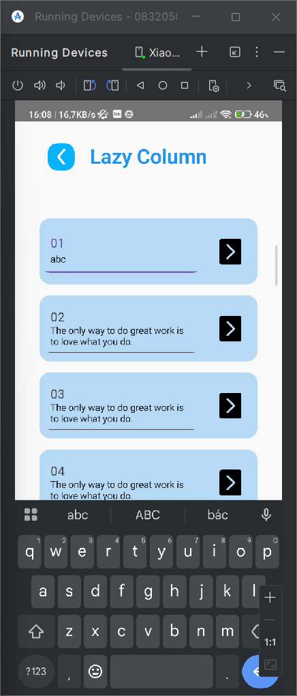
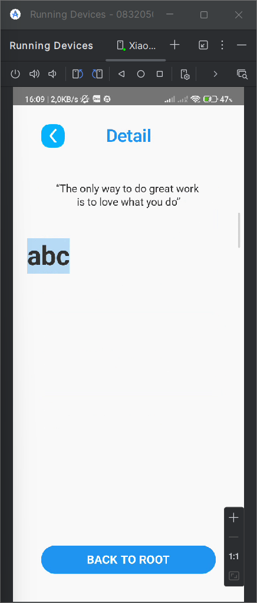
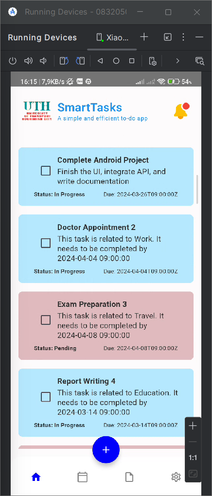
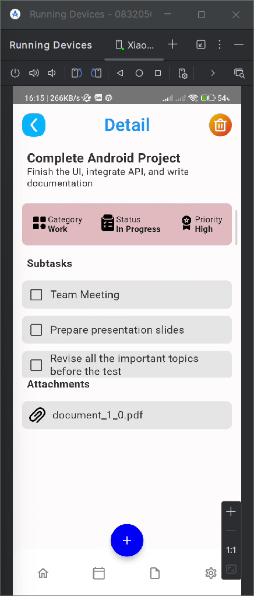

# 083205004013_NguyenHoHoangPhuc_Baitap4
## Câu 1:
- Dùng NavHost để quản lý các screen.
- Tạo 1 lazy column chứ 1000000 phần tử là 1 text field với mục đích là nhập dữ liệu để truyền cho screen tiếp theo.
- Điều hướng màn hình đơn giản với navController.navigate()
## Hình ảnh mô tả cho câu 1:
- Nhập dữ liệu vào text field:
- 
- Giao diện Detail:
- 

## Câu 2:
- Tạo các data class để chứa dữ liệu từ API.
- Tạo các biến view model để lưu dữ liệu kéo về từ API và sử dụng chúng.
## Hình ảnh mô tả cho câu 2:
- TODO-list:
- 
- Detail:
- 